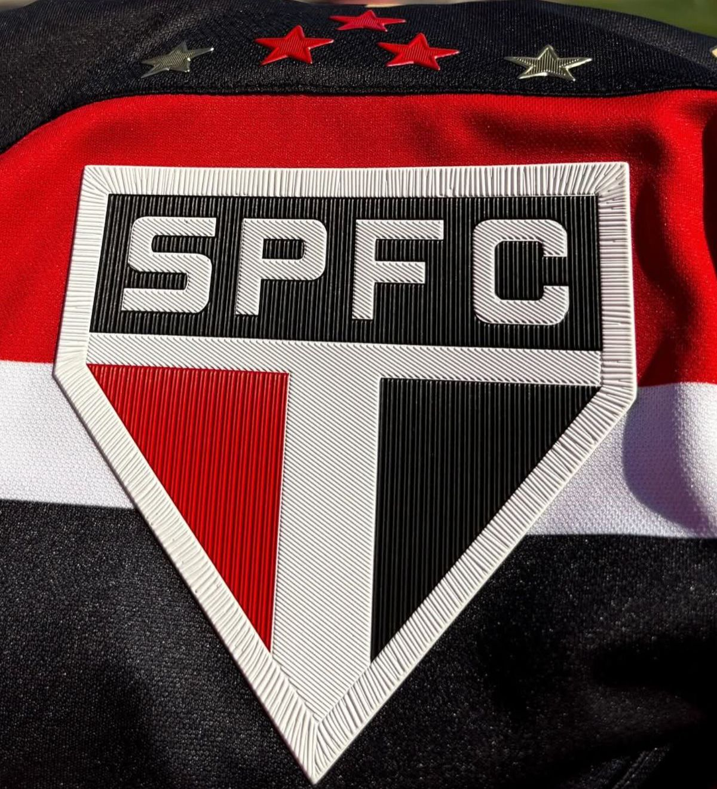

<!DOCTYPE html>
<html lang="pt-BR">
<head>
  <meta charset="UTF-8" />
  <meta name="viewport" content="width=device-width, initial-scale=1.0" />
  <title>Aniversário One Piece</title>

  <link href="https://fonts.googleapis.com/css2?family=Poppins:wght@300;400;600;800&family=Pacifico&display=swap" rel="stylesheet" />

  
</head>
<body>
  

    
especial de aniversário

    
Uma aventura está prestes a começar...

    

      Em um mar cheio de sonhos, existe um tesouro raro e especial. 
      Hoje, essa aventura é toda para <strong>CLARINHA</strong>.
    

    

  

  

    
⛵

    
🗺️

    
👒

    
☠️

  

  

  

    

      

      <h2 style="font-size:2rem; margin-bottom:10px;">Clique para abrir seu presente 🎁</h2>
      
Tem uma surpresa especial esperando por você.

      

        <h2>Maria Clara ✨</h2>
        

          Você é meu tesouro. Em meio a tantas aventuras da vida, sua presença faz tudo ficar mais bonito,
          mais leve e mais especial. Que seu aniversário seja cheio de emoção, alegria, sonhos e momentos
          inesquecíveis, como uma verdadeira jornada de One Piece. ☠️⚓🌸
            
          Que nunca faltem mapas para novos sonhos, um navio para seguir em frente e coragem para conquistar
          tudo o que seu coração deseja.
        

        <button class="close-gift" onclick="fecharPresente()">Fechar presente</button>
      

    

  

  

    <header>
      
☠️ One Piece Birthday

      
⚓ Uma aventura especial

    </header>

    <section class="hero">
      

        
Clarinha

      

      
você é meu tesouro ☠️

      
🗺️ Mapa do tesouro aberto • ⚓ Tripulação reunida • 👒 Chapéu de palha no visual

      

        
      

      

        Hoje é o seu dia... e essa é uma pequena aventura feita especialmente pra você.
        Que sua vida seja cheia de conquistas, felicidade e momentos inesquecíveis.
      

      

        <button class="btn btn-primary" onclick="mostrarTelaPresente()">Abrir presente 🎁</button>
        <button class="btn btn-secondary" onclick="tocarMusicaAnime()">Tocar música 🎵</button>
      

      
Música do seu cantor favorito.

      <audio id="animeMusic" controls style="margin-top:10px;">
        <source src="musica-anime.mp3" type="audio/mpeg">
        Seu navegador não suporta áudio.
      </audio>
    </section>

    <section>
      <h2 class="section-title">Coisas favoritas da Clarinha</h2>
      

        Luan Santana | Capivara | São Paulo | Lírios
      

      

        

          

             alt="Cantor favorito">
          

          
Cantor favorito

        

        

          

             alt="Animal favorito">
          

          
Animal preferido

        

        

          

            
          

          
Time do coração

        

        

          

            
          

          
Flor favorita

        

      

    </section>

    <section>
      <h2 class="section-title">Mensagem especial do Luizinho para você</h2>
      
Clarinha...

      

        Feliz aniversário! Hoje é o seu dia, e eu queria te lembrar que você é um verdadeiro tesouro.
        Sua presença deixa tudo mais especial, mais bonito e muito mais inesquecível.
          
        Que seu novo ciclo seja como uma grande aventura: cheio de conquistas, felicidade, coragem,
        pessoas especiais e sonhos se realizando a cada novo horizonte.

        

          <button class="btn btn-primary" onclick="mostrarSurpresa()">Clique para ver uma surpresa</button>
          

            🎁 Surpresa! Você é meu tesouro, minha capitã especial dessa aventura.
            Que nunca faltem sonhos, sorrisos, conquistas e momentos inesquecíveis no seu caminho! ☠️⚓✨
          

        

      

    </section>

    <footer>
      Feito com carinho por <strong>Luiz Fernando</strong> em uma aventura de aniversário digna de One Piece ☠️
    </footer>
  

  
</body>
</html>

